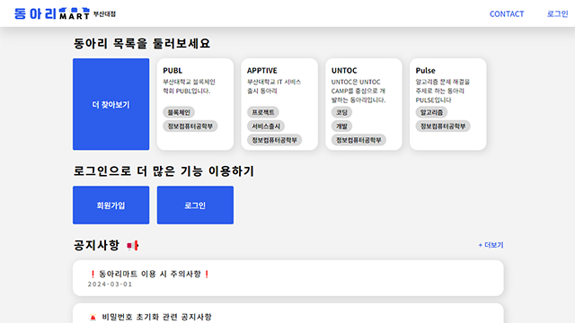
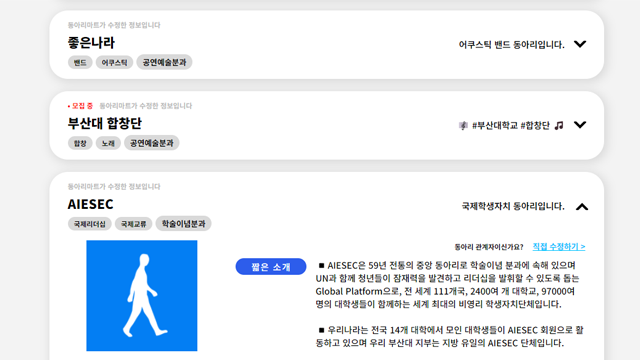
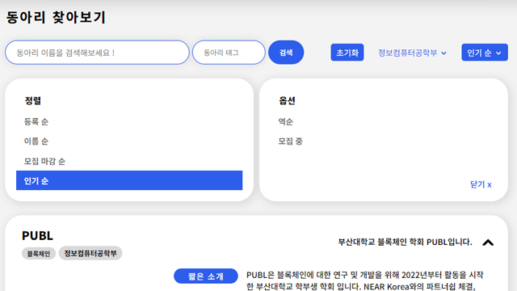
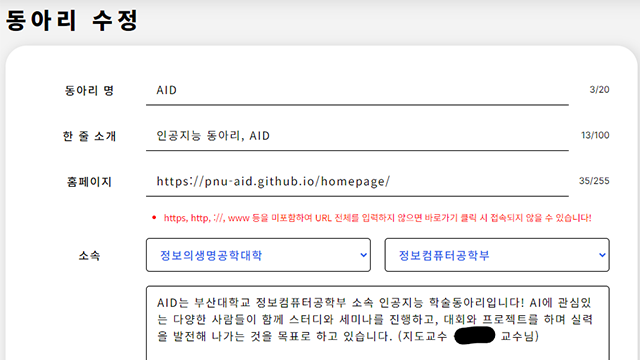
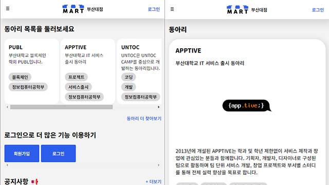

# 동아리마트
[동아리마트 바로가기](https://www.dongarimart.com/)

# 서비스 목적
- 일반학생
  + 부산대학교 홈페이지에서 찾기 힘든 동아리 정보 확인
  + 원하는 동아리 정보를 빠르게 확인
  + 동아리 지원절차를 쉽게
- 동아리 관계자
  + 동아리 정보를 간편하게 등록
  + 동아리 홍보 가능
  + 모집 공고 기능을 이용한 동아리 인원 모집

# Architecture

## 서비스 이미지

# Contributor
- [박규태](https://github.com/kyoutae1234) Back-End API
- [박재선](https://github.com/ggomabbang) AWS, CI/CD, Auth API, DB
- [이동훈](https://github.com/bluelemon61) Design, Frond-End & Back-End, API Specification

- [오지현](https://github.com/zeehy) Front-End
- [이승재](https://github.com/Ea3124) Back-end
- [이태경](https://github.com/taekoong) Frond-End & Back-End

# 1️⃣ Branch 이름 규칙

> **fix/소유권이전-버그**

`키워드` `/` `Branch 주제`

### 키워드 목록
- `feat` <- 기능 개발 (feature)
- `fix` <- 수정
- `chore` <- 코드와 무관한 document, comment 등

# 2️⃣ PR 이름 규칙   
> **Fix: 소유권이전-버그**

`키워드` `:` `PR 주제`

### 키워드 목록
- `feat` <- 기능 개발 (feature)
- `fix` <- 수정
- `chore` <- 코드와 무관한 document, comment 등

### 추가 설명
+ Git Branch 이름에서 띄어쓰기(space)를 하면 '-'로 변환되므로 띄어쓰기가 필요할 경우 그냥 CamelCase 또는 '-' 기호로 작성.
+ 문장형("신고 기능 추가", "회원가입시 ~안되는 현상 수정)" 🚫, 단어형("신고", "SignUp") ✅
+ Commit 이름은 그냥 자기가 하고 싶은 대로 남들이 봤을 때 알아볼 수 있을 정도로만 깔끔하게. 다만 키워드를 붙이면 좋다. `ex) feat: API 예외처리, fix: 마이페이지 UI 깨짐 해결...`
