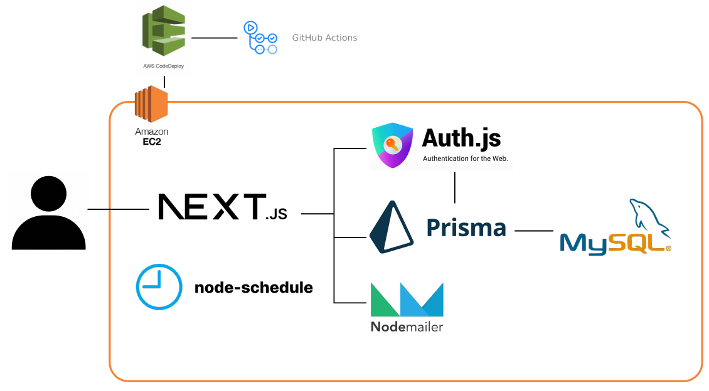

# Architecture

# Contributor
- [박규태](https://github.com/kyoutae1234) Back-End API
- [박재선](https://github.com/ggomabbang) AWS, CI/CD, Auth API, DB
- [이동훈](https://github.com/bluelemon61) Design, Frond-End & Back-End, API Specification

# 1️⃣ PR 이름 규칙   
>**4.2.1>MainTitle**

- `MAJOR.Minor.patch` 이전 PR 대비해서 숫자 누적
  - **MAJOR**: 큰 변화 시 올리고싶을 때 상의해서 올림
  - **Minor**: 기능 변경(+추가 및 삭제)
  - **patch**: Bug나 Code 정리 등 서비스를 이용하는 사람 기준에서 기능적인 변화가 1도 없음 하술할 '@' 기호가 쓰이는 경우 이걸 올리면 될 듯

- `MainTItle` <- 대표 주제. 정하기 힘들면 수정한 내용중 아무거나 콕 찝어서 하나만 쓰기. 간략하면 좋지만 문장형도 OK

### Example
- 1.1.0>FE 신고 기능   
- 1.1.1>recruit API 버그   
- 1.2.0>FE 로그인페이지 UI 변경

# 2️⃣ Branch 이름 규칙

> **MainCategory-SubCategory@BC**

- `MainCategory` <- 현재 브런치에서 가장 중요한 or 포괄하는 중심 주제
- `SubCategory` <- 없으면 안써도 됨

- `@` <- 단축어. 기능 추가 변경 없을때 (version에서 patch 변경 시) 사용
  - **B (Bug)**: 버그 수정
  - **C (Code)**: 코드 정리, 주석 삭제 및 추가, 알고리즘 최적화 (서비스를 이용하는 사람 기준에서 기능적인 변화가 1도 없음)

### Example
- API-admin@B
  - API를 다룸, admin 기능 관련,  버그 수정함, 기능 변화는 없습니다~

- SIgnUp
  - SignUp(회원가입)을 다룸, 세부사항을 적을 수 없을 정도로 내용이 너무 많거나 포괄적임

- API-recruit@C
  - API 기능변화는 없고 recruit 관련 API 코드 정리좀 했습니다~~ or 설명이 부족해서 주석좀 추가했습니다~

- FrontEnd-advertisement
  - 프론트엔드를 다룸, 광고 페이지 관련

- FrontEnd-@BC
  - 다방면으로 버그수정하고 코드 정리좀 했습니다. 기능 추가는 없습니다.

### 추가 설명
+ Github에서 띄어쓰기(space)를 하면 '-'로 변환되므로 띄어쓰기가 필요할 경우 그냥 CamelCase로 작성. ex. API-recruit, DB-UserPW
+ 문장형("신고 기능 추가", "회원가입시 ~안되는 현상 수정)" 🚫, 단어형("신고", "SignUp-@B") ✅
+ B,C 같은 단축어(@)는 우리가 실제로 개발하면서 단독으로 브런치 생성이 많이 된 케이스라 추가. 단축어는 콤마없이 나열.
+ B,C 같은 단축어(@)는 없어도 상관 X. Bug 수정만 있거나 Code 정리'만' 있을 때 사용. 특정 기능 추가하고 버그도 같이 잡았을때는 단축어 안써도 됨. 메인 주제가 아니니까!
+ Commit 이름은 그냥 자기가 하고 싶은 대로 남들이 봤을 때 알아볼 수 있을 정도로만 깔끔하게.