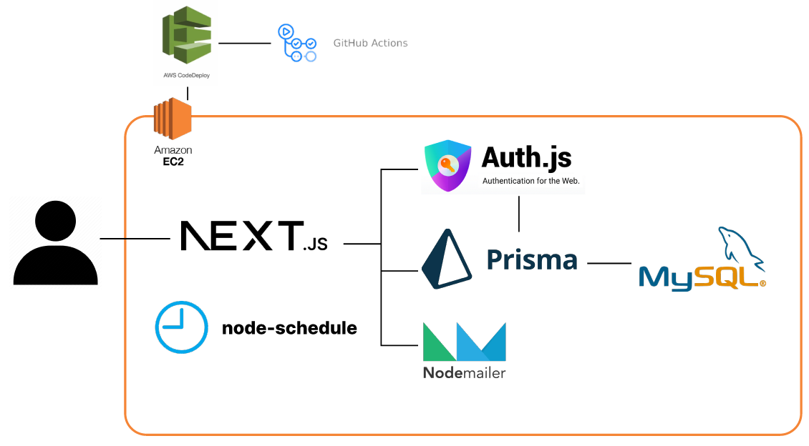
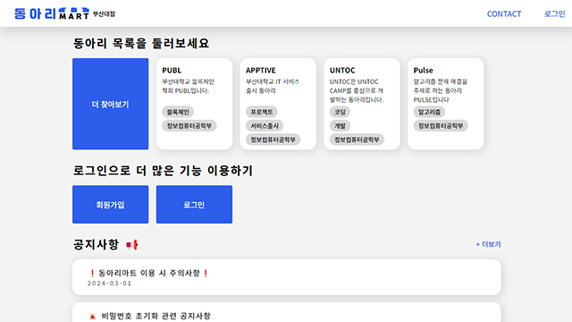
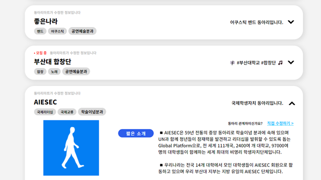
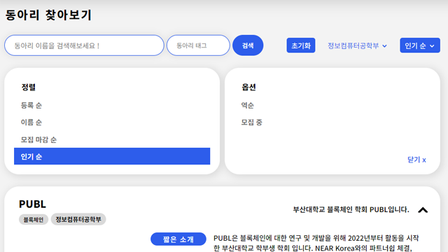
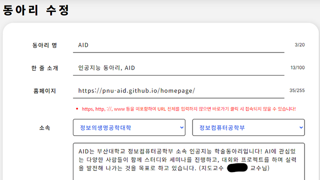
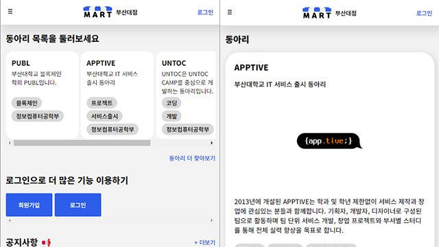
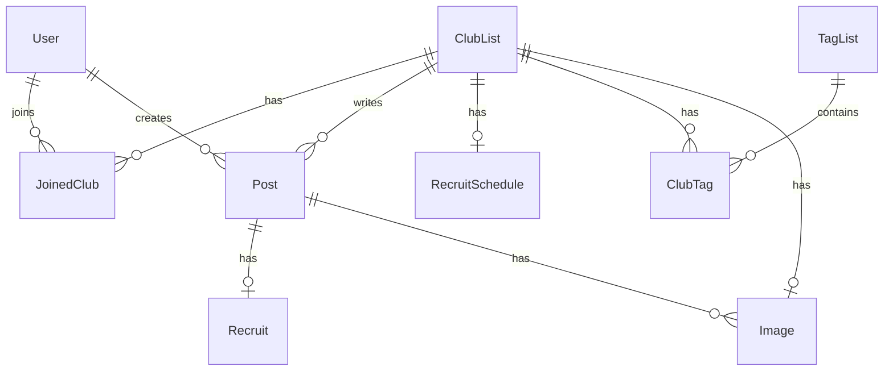
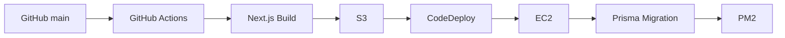

# 동아리마트
> 부산대학교 동아리 정보를 한곳에서 탐색하고 모집 정보를 확인할 수 있는 동아리 홍보 플랫폼

[동아리마트 바로가기](https://www.dongarimart.com/)

---
## 프로젝트 소개

동아리마트는 부산대학교 학생들이 교내 동아리 정보를 쉽게 탐색하고, 동아리 관계자가 동아리와 모집 정보를 직접 관리할 수 있도록 만든 서비스입니다. 

기존에는 동아리 정보와 모집 공고가 여러 채널에 흩어져 있어 원하는 정보를 찾기 어렵다는 문제가 있었습니다. 

동아리마트는 동아리 탐색부터 상세 정보, 모집 공고까지 하나의 서비스에서 확인할 수 있도록 하고, 동아리 관계자에게는 동아리를 등록하고 홍보할 수 있는 관리 기능을 제공합니다. 

---

## Contributor 

| 이름                                    | 주요 담당                                        |
| ------------------------------------- | -------------------------------------------- |
| [박규태](https://github.com/kyoutae1234) | Backend API                                  |
| [박재선](https://github.com/sunnypark87) | AWS, CI/CD, Authentication API, Database     |
| [이동훈](https://github.com/bluelemon61) | Design, Frontend, Backend, API Specification |
| [오지현](https://github.com/zeehy)       | Frontend                                     |
| [이승재](https://github.com/Ea3124)      | Backend                                      |
| [이태경](https://github.com/taekoong)    | Frontend, Backend                            |

---

## 서비스 목적
- 학생
  + 부산대학교 홈페이지에서 찾기 힘든 동아리 정보 확인
  + 원하는 동아리 정보를 빠르게 확인
  + 동아리 지원절차를 쉽게
- 동아리 관계자
  + 동아리 정보를 간편하게 등록
  + 동아리 홍보 가능
  + 모집 공고 기능을 이용한 동아리 인원 모집

---

## 시스템 구조



Next.js를 이용해 프론트엔드와 API를 하나의 애플리케이션에서 구성하고 Prisma를 통해 MySQL 데이터베이스에 접근합니다.

사용자 인증은 NextAuth를 기반으로 처리하며 동아리, 모집 공고, 게시글, 사용자 정보 등의 API를 제공합니다.

서비스는 AWS EC2에서 실행되며 GitHub Actions와 AWS CodeDeploy를 이용해 배포합니다.

---

## 서비스 이미지






---

## 기술 스택

| 구분                 | 기술                          |
| ------------------ | --------------------------- |
| Frontend           | `Next.js` `React`           |
| Backend            | `Next.js Route Handler`     |
| Authentication     | `NextAuth`                  |
| Database           | `MySQL` `Prisma`            |
| Email              | `Nodemailer`                |
| Deployment         | `AWS EC2` `S3` `CodeDeploy` |
| CI/CD              | `GitHub Actions`            |
| Process Management | `PM2`                       |

---

## 데이터 구조

서비스의 주요 데이터는 다음 관계를 중심으로 구성되어 있습니다.


```mermaid
erDiagram
    User ||--o{ JoinedClub : joins
    ClubList ||--o{ JoinedClub : has

    ClubList ||--o{ Post : writes
    User ||--o{ Post : creates

    ClubList ||--o| RecruitSchedule : has
    Post ||--o| Recruit : has

    ClubList ||--o{ ClubTag : has
    TagList ||--o{ ClubTag : contains

    ClubList ||--o| Image : has
    Post ||--o{ Image : has
```

주요 도메인은 다음과 같습니다.

* **ClubList**: 동아리 기본 정보
* **RecruitSchedule**: 동아리 모집 기간
* **Post / Recruit**: 게시글 및 모집 공고
* **User**: 사용자 정보
* **JoinedClub**: 사용자와 동아리의 소속 관계
* **TagList / ClubTag**: 동아리 태그
* **Image**: 동아리 및 게시글 이미지

---

## 배포 구조

`main` 브랜치에 변경 사항이 반영되면 GitHub Actions를 통해 자동 배포됩니다.


```mermaid
flowchart LR
    G[GitHub main]
    A[GitHub Actions]
    B[Next.js Build]
    S[S3]
    C[CodeDeploy]
    E[EC2]
    P[Prisma Migration]
    M[PM2]

    G --> A
    A --> B
    B --> S
    S --> C
    C --> E
    E --> P
    P --> M
```

### 배포 과정

1. `main` 브랜치 변경 감지
2. Node.js 환경 구성 및 의존성 설치
3. Next.js 애플리케이션 빌드
4. 배포 파일을 ZIP으로 패키징
5. AWS S3에 배포 파일 업로드
6. CodeDeploy를 통해 EC2로 배포
7. EC2에서 의존성 설치
8. Prisma Migration 및 Client 생성
9. PM2를 이용해 서비스 재시작

웹 애플리케이션과 함께 모집 기간을 관리하는 예약 작업도 PM2 프로세스로 실행합니다.

---

## 실행 방법

### 요구 환경

* Node.js
* MySQL

### 저장소 복제

```bash
git clone https://github.com/sunnypark87/dongarimart.git
cd dongarimart
```

### 의존성 설치

```bash
npm install
```

### Prisma Client 생성

```bash
npm run generate
```

### 개발 서버 실행

```bash
npm run dev
```

브라우저에서 아래 주소로 접속합니다.

```text
http://localhost:3000
```

---

## 주요 명령어

```bash
# 개발 서버
npm run dev

# 프로덕션 빌드
npm run build

# 프로덕션 서버
npm run start

# Prisma Migration
npm run migrate

# Prisma Client 생성
npm run generate

# 모집 상태 관리 작업
npm run cronjob
```

---

## 협업 방식

기능 개발은 별도의 브랜치에서 진행하고 Pull Request를 통해 `main` 브랜치에 반영합니다.

### 1️⃣ Branch 이름 규칙

> **fix/소유권이전-버그**

`키워드` `/` `Branch 주제`

### 키워드 목록
- `feat` <- 기능 개발 (feature)
- `fix` <- 수정
- `chore` <- 코드와 무관한 document, comment 등

### 2️⃣ PR 이름 규칙   
> **Fix: 소유권이전-버그**

`키워드` `:` `PR 주제`

### 키워드 목록
- `feat` <- 기능 개발 (feature)
- `fix` <- 수정
- `chore` <- 코드와 무관한 document, comment 등

### 추가 설명
+ Git Branch 이름에서 띄어쓰기(space)를 하면 '-'로 변환되므로 띄어쓰기가 필요할 경우 그냥 CamelCase 또는 '-' 기호로 작성.
+ 문장형("신고 기능 추가", "회원가입시 ~안되는 현상 수정)" 🚫, 단어형("신고", "SignUp") ✅
+ Commit 이름은 그냥 자기가 하고 싶은 대로 남들이 봤을 때 알아볼 수 있을 정도로만 깔끔하게. 다만 키워드를 붙이면 좋다. `ex) feat: API 예외처리, fix: 마이페이지 UI 깨짐 해결...`
