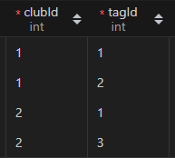

# 들어가기 전

Prisma Client는 DB의 [CURD](https://itworldyo.tistory.com/entry/%EB%8D%B0%EC%9D%B4%ED%84%B0%EB%B2%A0%EC%9D%B4%EC%8A%A4-CRUD%EB%8A%94-%EB%AC%B4%EC%97%87%EC%9D%BC%EA%B9%8C%EC%9A%94) 작업을 수월하게 도와주는 모듈입니다. 다만 prisma를 다루기전에 알아야할 몇가지 사항이 있어서 고것부터 설명들어갈게요.

## 관계형 데이터베이스

관계형 데이터베이스는 어떤 테이블에서 다른 테이블을 참조하는 형태를 말한다. 우리 데이터를 예를 들자면 동아리 목록에서 태그가 연계되어있는데 동아리와 태그는 서로 다른 테이블에 속해있는 것을 알 수 있다. 이 두가지의 데이터베이스를 서로 연결해주면서 관계형 데이터베이스라는 개념이 쓰이게 된다.

우선 **관계형 데이터베이스의 종류**를 알아보자

### 1:1

  일대일 관계라고 한다.

  사람 목록 테이블과 휴대전화번호 목록 테이블이 있는데 보통 한 사람당 하나의 전화번호가 있으므로 사람 하나의 데이터는 전화번호 하나의 데이터와 서로 연결되어있다.

### 1:N

  1대다 관계라고 한다.

  보통 하나의 게시물에는 여러개의 댓글이 달려있다. 게시글 테이블과 댓글 테이블이 있을 때 하나의 게시글 데이터에 여러개 댓글 데이터들이 연관되게 된다.

### N:M

  다대다 관계라고 한다.

  우리 프로젝트를 예시로 들 수 있다. 하나의 동아리에 여러개의 태그가 달릴 수 있다. 하지만 역으로 하나의 태그에 여러개의 동아리가 속해있을 수 있다.

### Self Relation

자기 자신을 참조하는 데이터베이스이다. 사람 데이터베이스가 있고 그 데이터 베이스안에 친구라는 칼럼도 존재한다면 친구 칼럼은 다시 사람 데이터베이스를 참조하게 될 것이다.

<br><br>

이제 **관계형 데이터를 접근하는 방법** 두 가지를 알아보자.

### 묵시적 방법 (implicit)

다른 DB를 참조하는 Column을 만들어 연결하는 방법이다.

예를 들어 동아리와 태그 데이터베이스 두 가지가 있다.

동아리가 태그를 가지기 때문에 동아리가 태그를 참조하기 위해 Tag라는 Colum을 만들고 이를 연결한다.

```SQL
model ClubList {
  clubid          Int         @id @default(autoincrement())
  clubname        String      @unique
  Tag             TagList?
}

model TagList {
  tagid           Int         @id @default(autoincrement())
  tagname         String
  parentclub      ClubList    @relation(fields: [parentclubid], references: [clubid])
  parentclubid    Int         @unique
}
```
위의 예시는 하나의 동아리가 하나의 태그만을 가지는 상황이다. 

ClubList안에 Tag라는 Column이 있고 데이터 타입으로는 **TagList**를 선택하고있다. 이는 **TagList**를 참조하는 칼럼이라는 뜻이며 **?** 기호도 붙어있는데, 이는 해당 칼럼이 **NULL**(데이터가 없어도 됨)이라는 소리이다.

TagList안에 parentclubid Column이 있고 속해있는 동아리의 id를 저장한다. **@unique**인 이유는 1대1 관계이기 때문에 하나의 태그가 속해있는 동아리는 유일해야하기 때문이다. 중복된다면 이는 1대1관계가 아닌 1대다 관계가 되어버린다.

TagList안에 parentclub Column이 있다. ClubList를 참조하고 있고 @relation이 중요한데, 이는 **field**에 해당하는 Column에 **references**에 해당하는 ClubList의 Column의 내용을 복제하겠다는 의미이다.

```SQL
model ClubList {
  clubid          Int         @id @default(autoincrement())
  clubname        String      @unique
  Tag             TagList[]
}

model TagList {
  tagid           Int         @id @default(autoincrement())
  tagname         String
  parentclub      ClubList    @relation(fields: [parentclubid], references: [clubid])
  parentclubid    Int         @unique
}
```

위는 1:N 관계에서 묵시적으로 연결한 DB이다. **?**를 **[]**로 변경한게 전부이다.

### 명시적 방법 (explicit)

다른 DB를 참조하는 Column을 만드는건 똑같지만 참조하는 테이블이 제 3의 테이블이다. 참조되는 테이블은 어떤 데이터가 어떤 데이터랑 연결되어있는지 저장하는 테이블이다.

동아리와 태그 테이블이 존재하고 N:M 관계라고 하자.

```SQL
model ClubList {
    id              Int         @id @default(autoincrement())
    clubName        String      @unique
    tags            ClubTag[]
}


model TagList {
    id              Int         @id @default(autoincrement())
    tagName         String      @unique
    clubs           ClubTag[]    
}

model ClubTag {
    club            ClubList    @relation(fields: [clubId], references: [id])
    tag             TagList     @relation(fields: [tagId], references: [id])
    clubId          Int
    tagId           Int

    @@id([clubId, tagId])
}
```

ClubList의 tag, TagList clubs 모두 ClubTag와 연결되어있다.

**ClubTag** 모델을 살펴보자. clubId와 tagId를 저장하고 있고 이는 각각 ClubList의 id와 TagList의 id를 참조하는 것을 알 수 있다.



실제로 저장된 데이터를 살펴보면 1번 동아리는 1,2번 태그와 연결되어있고 2번 동아리는 1, 3번 태그와 연결되어있다. 역으로 1번 태그는 1, 2번 동아리와 연결되어있고 2번 태그는 1번동아리와 연결되어있다.

이와 같은 방식으로 연결하는 것을 명시적으로 연결한다고 부른다.

<br>

추가로 더 자세히 알아보고 싶다면 [Prisma Docs Relations](https://www.prisma.io/docs/concepts/components/prisma-schema/relations)를 참고하자.

## new PrismaClient()

```js
import { PrismaClient } from "@prisma/client";

const client = new PrismaClient();
```

Prisma와 커넥션하는 Client를 생성하는 방법이다. 생성 이후, client 객체로 CURD 작업을 진행한다.

하지만, 모든 파일에 클라이언트를 생성한다면 실행되고있는 커넥션이 많아져 속도가 느려지게 되고 나중엔 CURD 작업에 피해를 끼칠 수 있다.

이를 해결하는 방법은 두가지이다.

### client.$disconnect()

CURD 작업을 모두 마친 후 .$disconnect() 메소드로 명시적으로 종료하는 방법이다.

```js
import { PrismaClient } from '@prisma/client'

const prisma = new PrismaClient()
const emailService = new EmailService()

async function main() {
  const allUsers = await prisma.user.findMany()
  const emails = allUsers.map((x) => x.email)

  await emailService.send(emails, 'Hello!')
}

main()
  .then(async () => {
    await prisma.$disconnect()
  })
  .catch(async (e) => {
    console.error(e)
    await prisma.$disconnect()
    process.exit(1)
  })
```

다만 이런 작업을 한다면 각각의 API에 모두 $disconnect() 메소드를 호출해야 할 것이다.

### global & export client

서버를 실행 후 하나의 prisma 클라이언트를 유지하며 사용하는 방법이 있다.

우선 [생성된 클라이언트를 내보내는 js파일](../../prisma/prisma.js)을 하나 작성한다. 다만, 그냥 생성하지 않고 global을 이용해 파일 호출이 끝나도 클라이언트가 유지가 되도록 작성한다.

```js
import { PrismaClient } from "@prisma/client";

const globalForPrisma = global;

const prisma = globalForPrisma.prisma || new PrismaClient();

if (process.env.NODE_ENV !== "production") globalForPrisma.prisma = prisma;

export default prisma;
```

그 후 CURD가 필요할때마다 해당 클라이언트를 import하여 작업을 수행한다.

```js
import { NextResponse } from "next/server";
import client from "../../../prisma/prisma";

export async function GET() {
  const result = await client.ClubList.findMany({
    include: {
      tags: {
        select: {
          tag: true
        },
      },
    },
  });
  return NextResponse.json(result);
}
```

prisma connection을 효율적으로 다루는 방법을 더 자세히 알고싶다면 [Prisma Docs connection management](https://www.prisma.io/docs/guides/performance-and-optimization/connection-management)를 살펴보자

# CURD를 해보자

이제 진짜 본론에 들어왔다. CURD를 해보자.

생성된 client객체를 이용하여 작업을 수행한다. 기본적인 구조는 아래와 같다.

```js
const result = await client.[model 또는 table 이름].[CURD 메소드](options)
```

아래는 예시이다.

```js
const result = await client.ClubList.findMany({
  include: {
    tags: {
      select: {
        tag: true
      },
    },
  },
});
```

우선 CURD 메소드 종류를 알아보자.

## Create

```js
create()
createMany()
```

아래는 예제 코드이다.

```js
const createMany = await prisma.user.createMany({
  data: [
    { name: 'Bob', email: 'bob@prisma.io' },
    { name: 'Yewande', email: 'yewande@prisma.io' },
    { name: 'Angelique', email: 'angelique@prisma.io' },
  ],
})
```

복수의 데이터를 넣을때는 createMany, 그리고 data 옵션에 객체가 아닌 여러개의 객체를 가진 배열을 넣어주어야한다.

## Read

```js
findUnique()
findMayny()
findFirst()
```

아래는 예제 코드이다.

```js
const user = await prisma.user.findUnique({
  where: {
    email: 'emma@prisma.io',
  },
  select: {
    email: true,
    posts: {
      select: {
        likes: true,
      },
    },
  },
})
```

```js
const users = await prisma.user.findMany({
  where: {
    role: 'ADMIN',
  },
  include: {
    posts: true,
  },
})
```

where 옵션은 일치하는 데이터를 찾을때 사용된다.

select 옵션은 해당 필드만 가져올때 사용된다.

include 옵션은 관계된 테이블의 정보까지 가져올 때 사용된다.

select와 include 옵션을 자세히 알고 싶다면 [Prisma Docs Select fields](https://www.prisma.io/docs/concepts/components/prisma-client/select-fields)를 참고하자.

## Update

```js
update()
updateMany()
upsert() // update or create
```

upsert는 해당 데이터가 있으면 update, 없으면 create하는 메소드이다.

아래는 예제 코드이다.

```js
const upsertUser = await prisma.user.upsert({
  where: {
    email: 'viola@prisma.io',
  },
  update: {
    name: 'Viola the Magnificent',
  },
  create: {
    email: 'viola@prisma.io',
    name: 'Viola the Magnificent',
  },
})
```

```js
const updateUsers = await prisma.user.updateMany({
  where: {
    email: {
      contains: 'prisma.io',
    },
  },
  data: {
    role: 'ADMIN',
  },
})
```

## Delete

```js
delete()
deleteMany()
```

아래는 예제코드이다.

```js
const deleteUsers = await prisma.user.deleteMany({
  where: {
    email: {
      contains: 'prisma.io',
    },
  },
})
```

# 관계형 데이터 참조하기

관계형 데이터를 참조할때는 옵션에 계단식으로 접근하는 방법이 필요하다.

참조하는 데이터에 create를 해보는 예제를 살펴보자.

```js
const result = await prisma.user.create({
  data: {
    email: 'elsa@prisma.io',
    name: 'Elsa Prisma',
    posts: {
      create: [
        { title: 'How to make an omelette' },
        { title: 'How to eat an omelette' },
      ],
    },
  },
  include: {
    posts: true, // Include all posts in the returned object
  },
})
```

위 예제를 살펴보면 user라는 테이블에서 연계된 post 테이블에 접근하여 post까지 생성하는 쿼리임을 알 수 있다.

그렇다면 이미 생성된 post가 존재하고 생성된 이후 연결하는 방법은 무엇일까? 아래 예제를 살펴보자.

```js
const result = await prisma.user.create({
  data: {
    email: 'vlad@prisma.io',
    posts: {
      connect: [{ id: 8 }, { id: 9 }, { id: 10 }],
    },
  },
  include: {
    posts: true, // Include all posts in the returned object
  },
})
```

이미 생성되었다면 connect, 아니라면 create를 동시에 할 수 없을까? 아래 예제를 살펴보자.

```js
const result = await prisma.post.create({
  data: {
    title: 'How to make croissants',
    author: {
      connectOrCreate: {
        where: {
          email: 'viola@prisma.io',
        },
        create: {
          email: 'viola@prisma.io',
          name: 'Viola',
        },
      },
    },
  },
  include: {
    author: true,
  },
})
```

위의 예제는 post라는 테이블에서 user테이블로 connectOrCreate를 하는 코드이다.

<br><br> 이제 직접 적용해보자.

우선 아래와 같은 N:M DB가 있다고 하자.

```SQL
model ClubList {
    id              Int         @id @default(autoincrement())
    clubName        String      @unique
    tags            ClubTag[]
}


model TagList {
    id              Int         @id @default(autoincrement())
    tagName         String      @unique
    clubs           ClubTag[]    
}

model ClubTag {
    club            ClubList    @relation(fields: [clubId], references: [id])
    tag             TagList     @relation(fields: [tagId], references: [id])
    clubId          Int
    tagId           Int

    @@id([clubId, tagId])
}
```

이와 같은 구조에서 Club의 Tag를 불러오기 위해서는 **ClubList->ClubTag->TagList**와 같은 접근이 필요하다.

만약 하나의 동아리에 여러 태그를 생성하며 연결해야한다면 어떻게 해야할까?

```js
const result = await client.ClubList.create({
  data: {
    clubName,
    tags: {
      create: tags.map((tag) => {
        return {
          tag: {
            connectOrCreate: {
              where: { tagName: tag },
              create: { tagName: tag },
            },
          }
        };
      }),
    },
  }
})
```

우선 ClubList에서 Club을 생성하며 tags 칼럼을 통해 ClubTag로 들어간다. 태그의 개수만큼 생성해야하므로 map 메소드를 이용해야하며, ClubTag에서 TagList로 연결하여 태그를 생성해야하므로 ClubTag 속 tag 칼럼에서 한번더 conectOrCreate를 사용하여 태그를 생성한다.